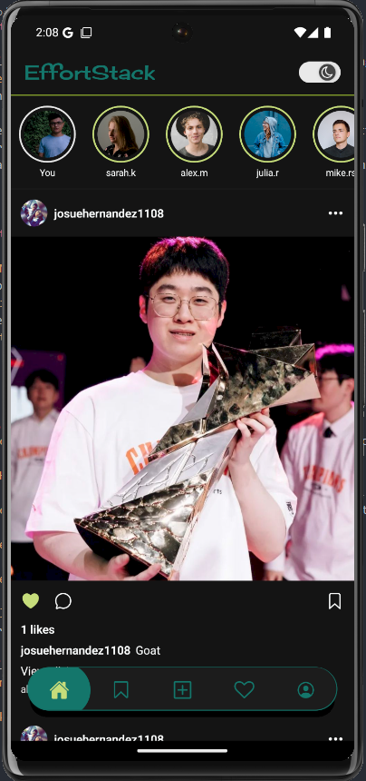
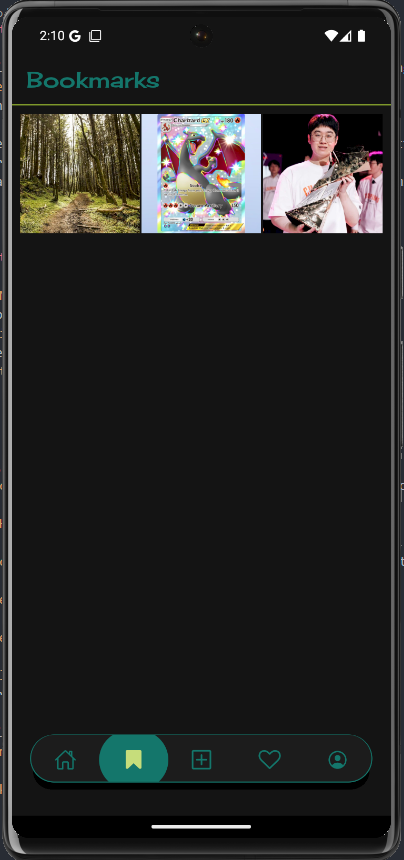
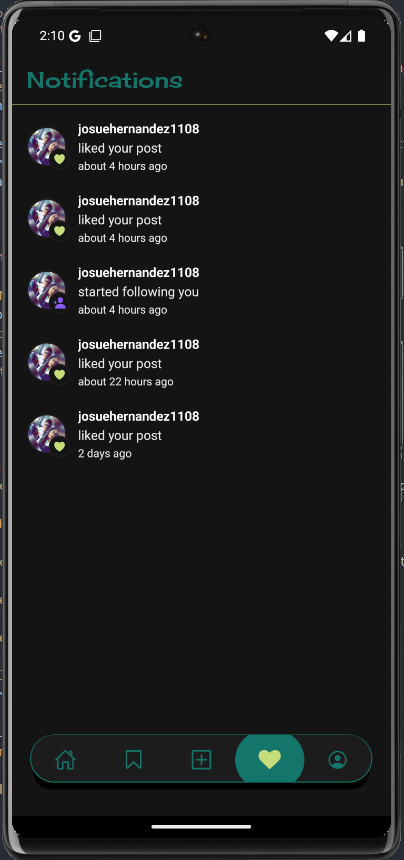
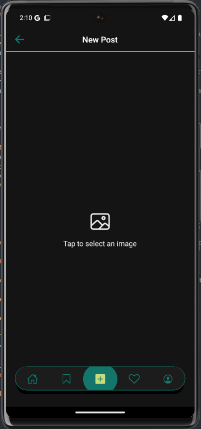
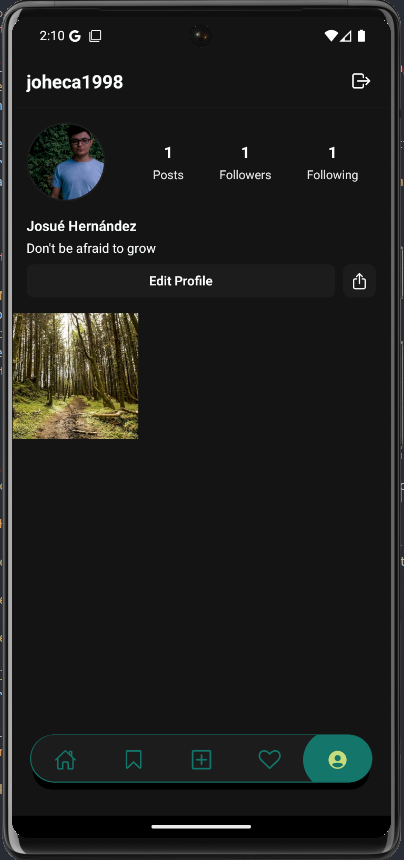
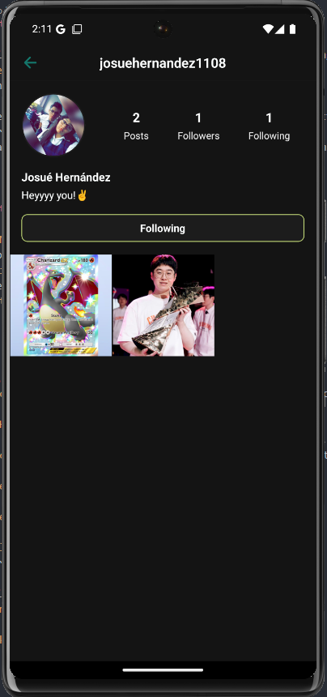

# 📱 React Native Social Media App with Expo, Clerk & Convex

A fully functional, cross-platform **social media app** built using **React Native** and **Expo**, powered by **Clerk** for authentication and **Convex** for real-time backend operations.

Ideal for developers looking to **learn by building**, this project demonstrates real-world implementations of mobile UI/UX, backend integration, and advanced features found in modern social platforms.

---

## 🚀 Key Features

- 🚀 **React Native + Expo** – Build cross-platform mobile apps with React knowledge  
- 📱 **Real-time Social Media App** – Works seamlessly on iOS, Android, and emulators  
- 🔐 **Authentication with Clerk** – Seamless Google login integration  
- 🔄 **Convex Backend** – Powers real-time features and data management  
- 📊 **7 Core Screens** – Auth, Home, Bookmarks, Create, Notifications, Profile, and User Profiles  
- ❤️ **Interactive Features** – Like, comment, bookmark, and follow users  
- 🖼️ **Media Handling** – Upload and share images from your device  
- 🔔 **Notification System** – Real-time like, follow, and comment notifications  
- ✏️ **Profile Editing** – Animated modal for easy profile customization  
- 📱 **Fundamental Components** – Learn essential React Native UI patterns  
- 🚀 **Special Files & Folder Structure** – Understand app, tabs, and layout structure  
- 📚 **Mobile Dev Concepts** – Splash screen, SafeAreaView, tab/stack navigation  
- ⚡ **Performance Optimization** – Smooth user experience  
- 🎨 **Custom Styling** – Add your own fonts and app icons  
- 🔄 **Webhooks Integration** – Learn interview-ready backend concepts  

---

## 🧱 Tech Stack

| Technology  | Description                                 |
|-------------|---------------------------------------------|
| [Expo](https://expo.dev/)           | Cross-platform framework for React Native  |
| [React Native](https://reactnative.dev/) | Mobile UI library with native performance |
| [Clerk](https://clerk.dev/)         | Auth provider with support for social login |
| [Convex](https://www.convex.dev/)   | Real-time backend with database & functions |
| [React Navigation](https://reactnavigation.org/) | Stack and tab navigation in React Native |
| [Reanimated](https://docs.swmansion.com/react-native-reanimated/) | Declarative animations for smooth UI      |

---

## ⚙️ Setup & Installation

1. **Clone the repo**
   ```bash
   git clone git@github.com:JHDEZ1108/es-spotlight-app.git
   cd es-spotlight-app
   ```

2. **Install dependencies**
   ```bash
   npm install
   ```

3. **Start the development server**
   ```bash
   npx expo start
   ```

> Make sure to set up your **Clerk** and **Convex** projects and link their credentials properly in the `.env` or config files.

---

## 💡 Ideal For:

- Learning how to structure scalable React Native apps  
- Practicing authentication and real-time data sync  
- Preparing for interviews with full-stack mobile experience  
- Exploring advanced UI/UX patterns and navigation  

---

## 📸 Screenshots

### 🏠 Home Screen – Public Feed  
Main feed displaying posts from all users. You can like, comment, or bookmark any post.



---

### 🔖 Bookmarks Screen – Saved Posts  
View all your saved posts for easy access later.



---

### 🔔 Notifications Screen – Activity Feed  
Get real-time notifications when someone likes, follows, or comments on your posts.



---

### 📤 Create Post – Upload Media  
Create new posts by uploading images from your device.



---

### 👤 Profile Screen – Your Profile  
Edit your profile, manage your posts, and view your followers.



---

### 👥 User Profile – Follow Other Users  
Explore other user profiles, see their posts, and follow them to stay updated.



---

Made with ❤️ by Josué Hernández
Happy Coding! 🚀
